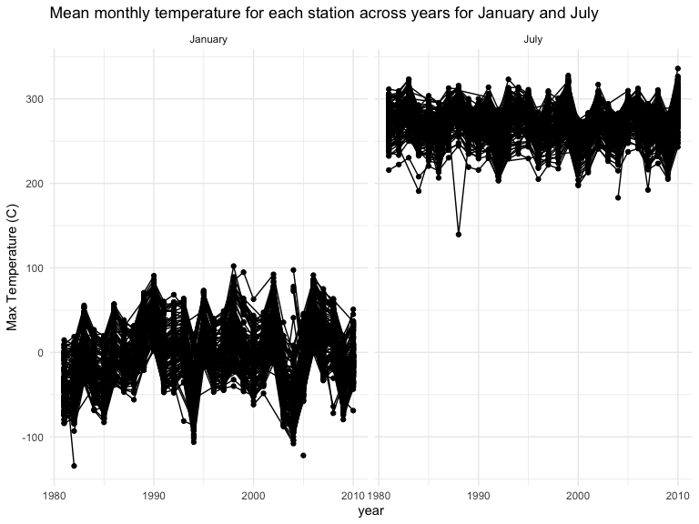
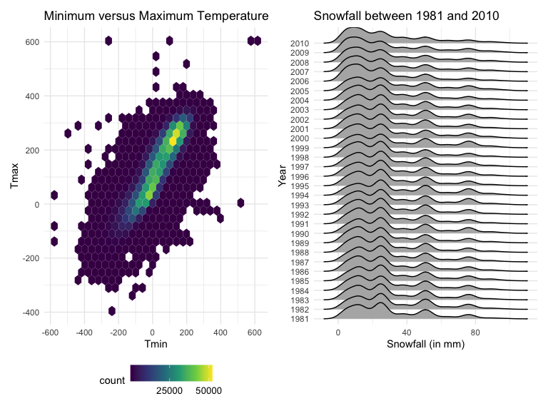
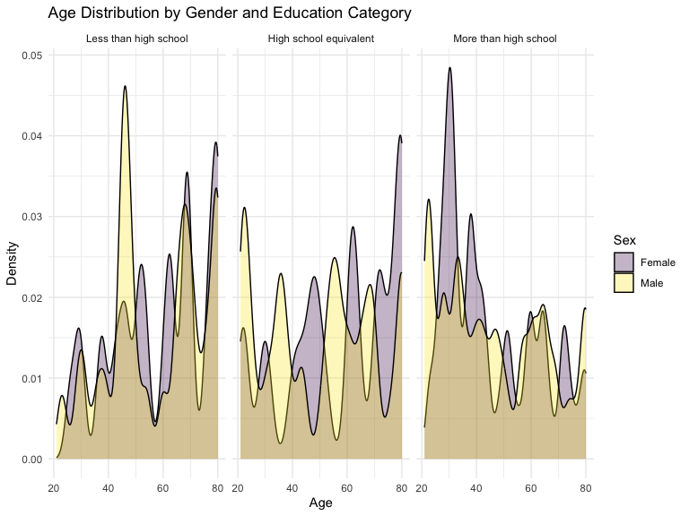
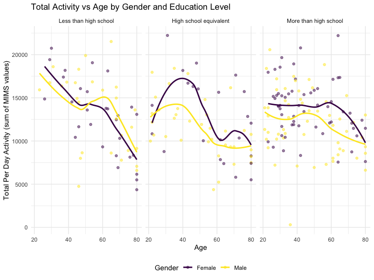
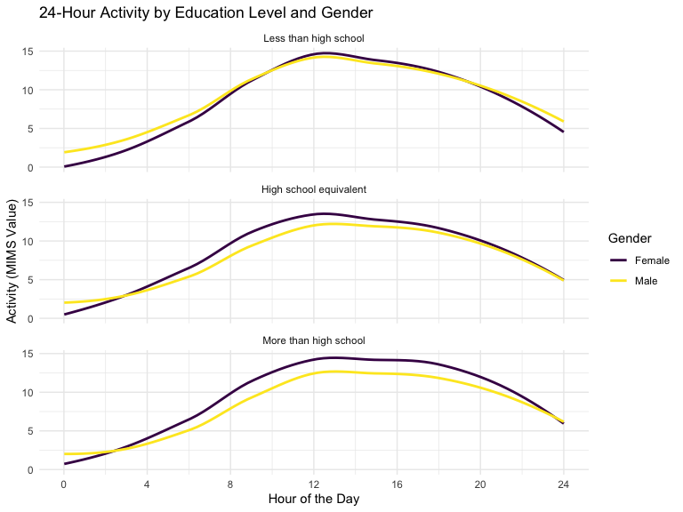
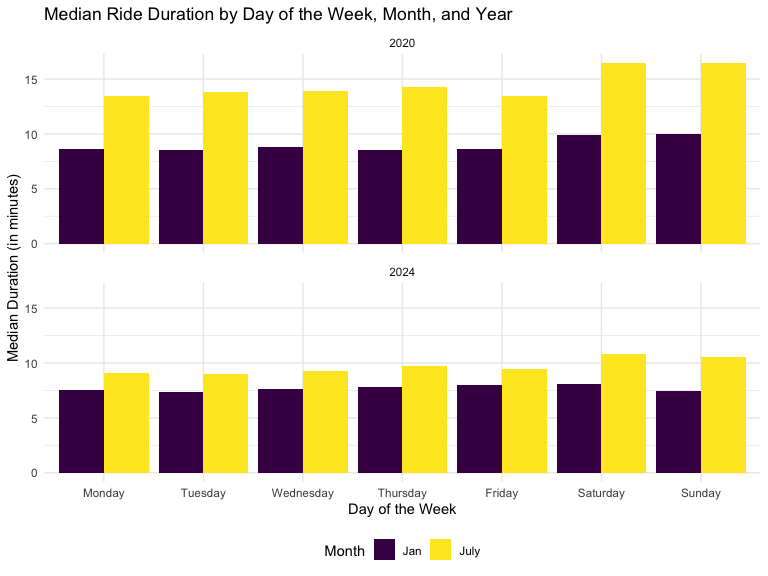
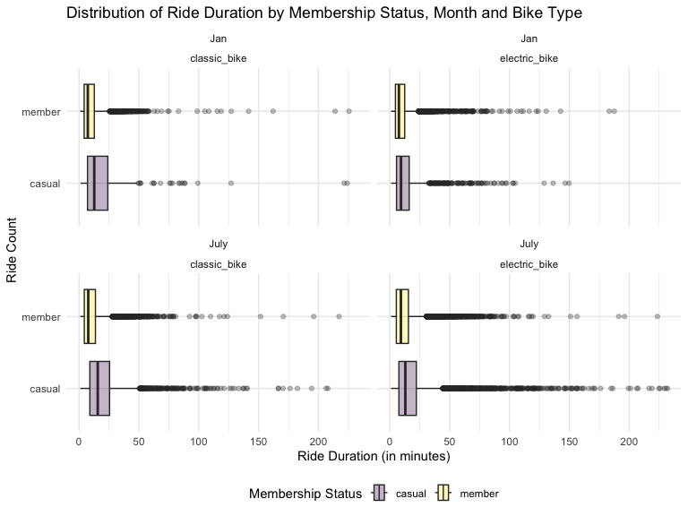

Viz and EDA
================
Chhiring Lama
2024-10-14

## Problem 1

#### Import the data

``` r
data("ny_noaa")
```

``` r
unique_id <- pull(ny_noaa, id) |> 
  unique() |> 
  length()

start_date <- pull(ny_noaa, date) |> 
  min() |> 
  year()

end_date <- pull(ny_noaa, date) |> 
  max() |> 
  year()
```

This data consists of 2595176 rows and 7 columns. The variable included
in the columns are weather station id, date of observation,
precipitation (tenth of mm), snowfall (mm), snow depth (mm), minimum and
maximum temperature(tenth of $^{\circ}C$). Data from 1981 to 2010 for
747 weather stations are included.

``` r
ny_noaa_clean <- ny_noaa |> 
  separate(date, into = c("year", "month", "day"), convert = TRUE) |>  
  mutate(tmin = as.numeric(tmin), 
         tmax = as.numeric(tmax))

snowfall_measure <- ny_noaa_clean |> 
  count(snow) |> 
  arrange(desc(n))

mostcommon_snowfall <- snowfall_measure |> first() |> pull(snow)
second_snowfall <- snowfall_measure |> slice(2) |> pull(snow)
```

To clean the data, we first separate the day, month and year of the date
variable, and converting `tmin` and `tmax` to a numeric variable. We
find that 0 mm is the most common snowfall overall. It makes sense
because it does not snow most of the time during the year in New York.
The second most common value for snowfall is NA which indicates missing
data for snowfall. The next most common values are 25, 13 and 51 which
suggest that snowfall was originally recorded in inches and then
converted to mm.

``` r
ny_noaa_clean |> 
  filter(month %in% c(1, 7)) |> 
  mutate(month = case_when(month == 1 ~ "January", 
                           month == 7 ~ "July")) |> 
  group_by(id, year, month) |> 
  summarize(mean_tmax = mean(tmax, na.rm = TRUE, color = id)) |>
  ungroup() |> 
  ggplot(aes(x = year, y = mean_tmax, group = id)) +
  geom_point() +
  geom_path() +
  facet_grid(~month) +
  labs(title = "Mean monthly temperature for each station across years for January and July", 
       y = "Max Temperature (C)") +
  theme(legend.position = "none")
```



Above is a two-panel plot showing average monthly max temperature in
January and in July for all the stations. Even though the mean month
weather across different stations for each are different, they fall
within the same range and have similar trend. In years with higher mean
max temperature for a stations, the max temperature for other stations
are also higher. As we would expect, it is much hotter in July than in
January for all the stations between 1981 and 2010. There was an
unusually cold July in 1988, and some less drastic outliers (colder
weather in January of 1982, 2005 and 1994).

``` r
hex_plot <-  ny_noaa_clean |> 
  ggplot(aes(x = tmin, y = tmax)) + 
  geom_hex() +
  scale_x_continuous(breaks = c(-600, -400, -200, 0, 200, 400, 600)) +
  scale_y_continuous(breaks = c(-400, -200, 0, 200, 400, 600)) +
  scale_fill_continuous(breaks =c(0, 25000, 50000)) +
  labs(title = "Minimum versus Maximum Temperature", x = "Tmin", y = "Tmax") +
  theme(legend.text = element_text(size = 10))

ridge_plot <- ny_noaa_clean |> 
  filter(snow < 100, snow > 0) |>
  ggplot(aes(x = snow, y = as.factor(year))) + 
  geom_density_ridges() +
  labs(title = "Snowfall between 1981 and 2010", x = "Snowfall (in mm)", y = "Year")
  
hex_plot + ridge_plot
```



We made a two-panel plot to show `tmax` vs `tmin` overall using hex plot
(left) and per year snowfall distribution (right).For the hex plot,
majority of data cluster around the center of the distributions with
`tmin` being quite close/slightly lower than the `tmax` of the date.
There were fewer instances of where the temperature fluctuated by a lot,
raising questions about the quality of data collected on the day. Most
of the stations experience between 0 and 35 mm of snow per year. The
overall distribution is multimodal, with another two groups of stations
with near 50 mm and 80 mm of snow every year. This likely comes from
converting one system of measure to another (fractions of an inch to
another tenth of mm).

## Problem 2

#### Load the datasets:

``` r
demographic_df <- read_csv("data/nhanes_covar.csv", skip = 4) |> 
  janitor::clean_names() 
  
accelerometer_df <- read_csv("data/nhanes_accel.csv")|> 
  janitor::clean_names() |> 
  pivot_longer(
    cols = min1:min1440, 
    names_to = "minute_count", 
    values_to = "mims_value", 
    names_prefix = "min"
  ) |> 
  mutate(minute_count = minute_count)

complete_mims_df <- demographic_df |> 
  inner_join(accelerometer_df, by = "seqn") |> 
  drop_na(sex, age, education)

filtered_mims_df <- complete_mims_df |> 
  filter(age > 20) |> 
  rename(participant_id = seqn) |> 
  mutate(minute_count = as.numeric(minute_count), 
         sex = case_when(sex == 1 ~"Male", 
                         sex == 2 ~ "Female"), 
         sex = as.factor(sex),
         education = case_when(education == 1 ~ "Less than high school", 
                               education == 2 ~ "High school equivalent", 
                               education == 3 ~ "More than high school"), 
         education = factor(education, levels = c("Less than high school", 
                                                  "High school equivalent", "More than high school")))
```

Using the code above, we first import the individual demographics and
accelerometer data separately. In both the datasets, we cleaned the
column names. For `accelerometer_df`, because a single variable (minute
count) is spread out in multiple columns with MIMS value as their value,
we tidied the data using `pivot_longer` to combined all the minute
counts as `minute_count` and values under `mims_value` columns. We
combined the two datasets by the corresponding index: `seqn` using
`inner_join`, and only kept observations from participants who are at
least 21 years old. We tried removing all the rows with missing
demographic data (sex, age and education). For the nominal categorical
variables, `sex` and `education`, we converted the value types as
`factor`.

``` r
filtered_mims_df |> 
  group_by(sex, education) |> 
  summarize(number_of_minute_reads = n(), 
            mean_bmi = round(mean(bmi, na.rm = TRUE),digits = 2),  
            mean_mims = round(mean(mims_value, na.rm = TRUE),digits = 2)) |> 
  knitr::kable()
```

| sex    | education              | number_of_minute_reads | mean_bmi | mean_mims |
|:-------|:-----------------------|-----------------------:|---------:|----------:|
| Female | Less than high school  |                  41760 |    31.18 |      8.83 |
| Female | High school equivalent |                  33120 |    31.71 |      8.72 |
| Female | More than high school  |                  84960 |    28.75 |      9.59 |
| Male   | Less than high school  |                  40320 |    28.30 |      9.23 |
| Male   | High school equivalent |                  51840 |    29.05 |      8.04 |
| Male   | More than high school  |                  80640 |    29.02 |      8.36 |

As seen in the table above, there are above thirty-three thousands
per-minute reads for MIMS (Monitor-Independent Movement Summary) value
for both men and women in each education category. Male and female
participants with more than high school education represent the most
amount of reads. Looking at the MIMS value themselves, women with more
than high school education had the greatest average movement, followed
by men with less than high school education. However, women with less
than high school education had the least amount of movement during the
day. Looking at the summary value, MIMS value and BMI seem to be
correlated. Within each gender, participants with the highest movement
had the lowest average BMI.

``` r
filtered_mims_df |> 
  ggplot(aes(x = age, fill = sex)) +
  geom_density(alpha = 0.3) +
  facet_wrap(~education) +  
  labs(title = "Age Distribution by Gender and Education Category",
       x = "Age",
       y = "Density") +
  scale_fill_viridis_d("Sex") +
  theme_minimal()
```



As seen the density plot above, distribution of men and women differs in
each education category. Participants with less than high school
education in men are mostly in their 40s and in women are more in their
late 80s. Overall, in this category, there are more older women. Younger
men (in their earlier 20s) and older women (in their late 70s) represent
the higher proportion of participants with high school education.
Similarly, participants with more than high school education are in
their early 20s the most, and late 20s/early 30s in women and men
respectively.

``` r
total_activity <- filtered_mims_df |>
  group_by(participant_id, age, sex, education) |>
  summarise(perday_activity = sum(mims_value, na.rm = TRUE), .groups = 'drop')

total_activity  |> 
  ggplot(aes(x = age, y = perday_activity, color = sex)) +
  geom_point(alpha = 0.5) + 
  geom_smooth(method = "loess", se = FALSE) + 
  facet_grid(~ education) +  
  labs(title = "Total Activity vs Age by Gender and Education Level",
       x = "Age",
       y = "Total Per Day Activity (sum of MIMS values)",
       color = "Gender")
```



Using our tidied dataset, we aggregated MIMS value across all the
minutes for each participant to create `perday_activity` that has total
activity for the participant. Looking at the total per day activity of
the participants in the plot above, we can see that men with high school
education and above have lower activity in general than their female
counterparts of the same age. In participants with less than high school
education, women under 50 years were more active while after 50 years,
men were more active. Total activity level decreased with age, and more
drastically after 60 years in participants with either less or more than
high school education. Overall, people with higher education level had
lower activity level. It could because they tend to end up in more
sedentary occupations.

``` r
minute_activity <- filtered_mims_df |>
  group_by(participant_id, age, sex, education, minute_count) |>
  summarise(mims_value = sum(mims_value, na.rm = TRUE), .groups = 'drop') 


minute_activity |>
  ggplot(aes(x = minute_count, y = mims_value, color = sex)) +
  #geom_line(aes(group = participant_id), alpha = 0.2) +  
  geom_smooth(method = "gam", se = FALSE, linewidth = 1) +  
  facet_wrap(~education, ncol = 1) +  
  labs(title = "24-Hour Activity by Education Level and Gender",
       x = "Hour of the Day",
       y = "Activity (MIMS Value)",
       color = "Gender") +
  scale_x_continuous(breaks = seq(0, 1440, by = 240), labels = seq(0, 24, by = 4)) +  
  theme_minimal()
```



Although the changes in activity per participant is hard to follow
through, with smooth trends, we can see that activity level of people in
all three education categories peak between late morning and mid-day.
Women with at least high school education in general have higher
activity level than their male counterparts during the day.

## Problem 3

#### Import the datasets:

``` r
cite_bike_files <- list.files("data/citibike")
names_df <- c("2020-Jan", "2024-Jan", "2020-July", "2024-July")

per_month_citibik_df <- lapply(1:4, function(index){
  print(names_df[index])
  df <- read_csv(paste0("data/citibike/", cite_bike_files[index])) |> 
    mutate(time = names_df[index], 
           rideable_type = as.factor(rideable_type), 
           weekdays = factor(weekdays, levels = c("Monday", "Tuesday", "Wednesday", "Thursday", 
                                                  "Friday", "Saturday", "Sunday")), 
           member_casual = as.factor(member_casual)) |> 
    separate(time, into = c("year", "month"), sep = "-") |> 
    mutate(year = as.integer(year))
  return(df)
})
```

    ## [1] "2020-Jan"

    ## [1] "2024-Jan"

    ## [1] "2020-July"

    ## [1] "2024-July"

``` r
names(per_month_citibik_df) <- names_df
```

The datasets imported above contain 1% of all rides with a total
duration less than 4 hours in each of the four months (January and July
of 2020 and 2024). After importing and adding `month` and `year`values,
each of the datasets have 9 columns indicating ride id, bike type, day
of the week, duration of ride (in minutes), start and end station name,
member status, month and year. Among them the columns `rideable_type`,
`weekdays` and `member_casual` have categorical variables with countable
groups, so we converted them to `factor` variables. We have a total of
12420, 18861, 21048 and 47156 rows for January 2020, January 2020, July
2020 and July 2024 respectively.

#### Combine the datasets:

``` r
combined_citike_df <- bind_rows(per_month_citibik_df)
```

#### Create a reader-friendly table:

``` r
combined_citike_df |> 
  group_by(member_casual, year, month) |> 
  summarise(total_rides = n()) |> 
  arrange(year, month, member_casual) |> 
  relocate(year, month, member_casual) |> 
  rename(member_status = member_casual) |> 
  knitr::kable()
```

| year | month | member_status | total_rides |
|-----:|:------|:--------------|------------:|
| 2020 | Jan   | casual        |         984 |
| 2020 | Jan   | member        |       11436 |
| 2020 | July  | casual        |        5637 |
| 2020 | July  | member        |       15411 |
| 2024 | Jan   | casual        |        2108 |
| 2024 | Jan   | member        |       16753 |
| 2024 | July  | casual        |       10894 |
| 2024 | July  | member        |       36262 |

In total, for each of the four different month and year combinations.
Citi Bike members had higher total number of bike rides compared to
casual riders. This could be because the member bike riders likely use
them for regular commute whereas casual riders use it recreationally. We
can see that both the number of casual and member rides have increased
in 2024 when compared to the same months in 2020.

``` r
popular_stations <- combined_citike_df |> 
  filter(year == 2024, month == "July") |>
  group_by(start_station_name) |> 
  summarise(total_rides = n()) |> 
  arrange(desc(total_rides)) |>
  slice(1:5) 

popular_stations |> 
  knitr::kable()
```

| start_station_name       | total_rides |
|:-------------------------|------------:|
| Pier 61 at Chelsea Piers |         163 |
| University Pl & E 14 St  |         155 |
| W 21 St & 6 Ave          |         152 |
| West St & Chambers St    |         150 |
| W 31 St & 7 Ave          |         146 |

``` r
station_names <- pull(popular_stations, start_station_name)
most_rides <- pull(popular_stations, total_rides)[1]
```

The most popular starting station in July 2024 is Pier 61 at Chelsea
Piers with 163 rides. The next 4 stations are University Pl & E 14 St, W
21 St & 6 Ave, West St & Chambers St and W 31 St & 7 Ave with all more
than 140 rides each.

``` r
combined_citike_df  |>
  group_by(year, month, weekdays) |>
  summarise(median_duration = median(duration, na.rm = TRUE)) |>
  ggplot(aes(x = weekdays, y = median_duration, fill = month)) +
  geom_bar(stat = "identity", position = position_dodge()) +
  facet_wrap(~year, ncol = 1) +
  labs(title = "Median Ride Duration by Day of the Week, Month, and Year",
       x = "Day of the Week",
       y = "Median Duration (in minutes)",
       fill = "Month") 
```



Rides are higher in July in each of the weekdays in both 2020 and 2024
which could be due to having a weather more conducive for biking.
Similarly, median rides each day has decreased in 2024 (mostly between 5
and 10) compared to 2020 (above 10 rides in July). A trend that is
similar in the summer month (July) between the two years are that there
were higher numbers of riders on Saturday and Sunday of rides than
during the weekdays. This could be attributed to better weather and more
people riding recreationally. Even though a similar trend was seen in
2020 January, it is not necessary true in 2024.

``` r
combined_citike_df |>
  filter(year == 2024) |>
  ggplot(aes(x = duration, y = member_casual, fill = member_casual)) +
  geom_boxplot(alpha = 0.3) +
  facet_wrap(~ month + rideable_type) +
  labs(title = "Distribution of Ride Duration by Membership Status, Month and Bike Type",
       x = "Ride Duration (in minutes)",
       y = "Ride Count",
       fill = "Membership Status") 
```



For 2024, at least 75% of the each ride types ended within 30 minutes of
the ride. Citi Bike members had lower ride duration in both electric and
classic bike. This is true for the months of both January and July.
Classic bikes are ridden for longer duration than electric bikes. One of
the possible reason could be that electric bikes in city bikes are twice
as expensive. Although classic bike ride duration remained similar in
January and July, the electric bike ride duration (especially for casual
riders) have increased in July from January. Could this again be linked
with the weather and how much more people are willing to pay to engage
in outdoor activity during the summer?
