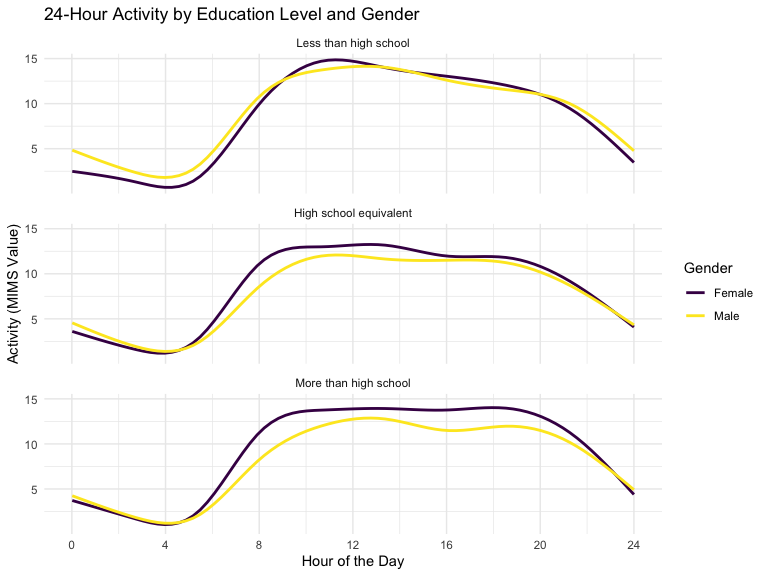

Viz and EDA
================
Chhiring Lama
2024-10-14

## Problem 1

#### Import the data

``` r
data("ny_noaa")
```

``` r
unique_id <- pull(ny_noaa, id) |> 
  unique() |> 
  length()

start_date <- pull(ny_noaa, date) |> 
  min() |> 
  year()

end_date <- pull(ny_noaa, date) |> 
  max() |> 
  year()
```

This data consists of 2595176 rows and 7 columns. The variable included
in the columns are weather station id, date of observation,
precipitation (tenth of mm), snowfall (mm), snow depth (mm), minimum and
maximum temperature(tenth of $^{\circ}C$). Data from 1981 to 2010 for
747 weather stations are included.

``` r
ny_noaa_clean <- ny_noaa |> 
  separate(date, into = c("year", "month", "day"), convert = TRUE) |>  
  mutate(tmin = as.numeric(tmin), 
         tmax = as.numeric(tmax))

snowfall_measure <- ny_noaa_clean |> 
  count(snow) |> 
  arrange(desc(n))

mostcommon_snowfall <- snowfall_measure |> first() |> pull(snow)
second_snowfall <- snowfall_measure |> slice(2) |> pull(snow)
```

To clean the data, we first separate the day, month and year of the date
variable, and converting `tmin` and `tmax` to a numeric variable. We
find that 0 mm is the most common snowfall overall. It makes sense
because it does not snow most of the time during the year in New York.
The second most common value for snowfall is NA which indicates missing
data for snowfall. The next most common values are 25, 13 and 51 which
suggest that snowfall was originally recorded in inches and then
converted to mm.

``` r
ny_noaa_clean |> 
  filter(month %in% c(1, 7)) |> 
  mutate(month = case_when(month == 1 ~ "January", 
                           month == 7 ~ "July")) |> 
  group_by(id, year, month) |> 
  summarize(mean_tmax = mean(tmax, na.rm = TRUE, color = id)) |>
  ungroup() |> 
  ggplot(aes(x = year, y = mean_tmax, group = id)) +
  geom_point() +
  geom_path() +
  facet_grid(~month) +
  labs(title = "Mean monthly temperature for each station across years for January and July", 
       y = "Max Temperature (C)") +
  theme(legend.position = "none")
```


Above is a two-panel plot showing average monthly max temperature in
January and in July for all the stations. Even though the mean month
weather across different stations for each are different, they fall
within the same range and have similar trend. In years with higher mean
max temperature for a stations, the max temperature for other stations
are also higher. As we would expect, it is much hotter in July than in
January for all the stations between 1981 and 2010. There was an
unusually cold July in 1988, and some less drastic outliers (colder
weather in January of 1982, 2005 and 1994).

``` r
hex_plot <-  ny_noaa_clean |> 
  ggplot(aes(x = tmin, y = tmax)) + 
  geom_hex() +
  scale_x_continuous(breaks = c(-600, -400, -200, 0, 200, 400, 600)) +
  scale_y_continuous(breaks = c(-400, -200, 0, 200, 400, 600)) +
  scale_fill_continuous(breaks =c(0, 25000, 50000)) +
  labs(title = "Minimum versus Maximum Temperature", x = "Tmin", y = "Tmax") +
  theme(legend.text = element_text(size = 10))

ridge_plot <- ny_noaa_clean |> 
  filter(snow < 100, snow > 0) |>
  ggplot(aes(x = snow, y = as.factor(year))) + 
  geom_density_ridges() +
  labs(title = "Snowfall between 1981 and 2010", x = "Snowfall (in mm)", y = "Year")
  
hex_plot + ridge_plot
```


We made a two-panel plot to show `tmax` vs `tmin` overall using hex plot
(left) and per year snowfall distribution (right).For the hex plot,
majority of data cluster around the center of the distributions with
`tmin` being quite close/slightly lower than the `tmax` of the date.
There were fewer instances of where the temperature fluctuated by a lot,
raising questions about the quality of data collected on the day. Most
of the stations experience between 0 and 35 mm of snow per year. The
overall distribution is multimodal, with another two groups of stations
with near 50 mm and 80 mm of snow every year. This likely comes from
converting one system of measure to another (fractions of an inch to
another tenth of mm).

## Problem 2

#### Load the datasets:

``` r
demographic_df <- read_csv("data/nhanes_covar.csv", skip = 4) |> 
  janitor::clean_names() 
  
accelerometer_df <- read_csv("data/nhanes_accel.csv")|> 
  janitor::clean_names() |> 
  pivot_longer(
    cols = min1:min1440, 
    names_to = "minute_count", 
    values_to = "mims_value", 
    names_prefix = "min"
  ) |> 
  mutate(minute_count = minute_count)

complete_mims_df <- demographic_df |> 
  inner_join(accelerometer_df, by = "seqn") |> 
  drop_na(sex, age, education)

filtered_mims_df <- complete_mims_df |> 
  filter(age > 20) |> 
  rename(participant_id = seqn) |> 
  mutate(minute_count = as.numeric(minute_count), 
         sex = case_when(sex == 1 ~"Male", 
                         sex == 2 ~ "Female"), 
         sex = as.factor(sex),
         education = case_when(education == 1 ~ "Less than high school", 
                               education == 2 ~ "High school equivalent", 
                               education == 3 ~ "More than high school"), 
         education = factor(education, levels = c("Less than high school", 
                                                  "High school equivalent", "More than high school")))
```

Using the code above, we first import the individual demographics and
accelerometer data separately. In both the datasets, we cleaned the
column names. For `accelerometer_df`, because a single variable (minute
count) is spread out in multiple columns with MIMS value as their value.
So, we tidied the data using `pivot_longer` to combined all the minute
counts as `minute_count` and values under `mims_value` columns. We
combined the two datasets by the corresponding index: `seqn` using
`inner_join`. We tried removing all the rows with missing demographic
data (sex, age and education). For the nominal categorical variables,
`sex` and `education`, we converted the value types as `factor`.

``` r
filtered_mims_df |> 
  group_by(sex, education) |> 
  summarize(number_of_minute_reads = n(), 
            mean_bmi = mean(bmi, na.rm = TRUE), 
            mean_mims = mean(mims_value, na.rm = TRUE)) |> 
  knitr::kable()
```

| sex    | education              | number_of_minute_reads | mean_bmi | mean_mims |
|:-------|:-----------------------|-----------------------:|---------:|----------:|
| Female | Less than high school  |                  41760 | 31.17857 |  8.834386 |
| Female | High school equivalent |                  33120 | 31.71304 |  8.721839 |
| Female | More than high school  |                  84960 | 28.75085 |  9.592266 |
| Male   | Less than high school  |                  40320 | 28.30370 |  9.232080 |
| Male   | High school equivalent |                  51840 | 29.04571 |  8.035692 |
| Male   | More than high school  |                  80640 | 29.01786 |  8.362123 |

As seen in the table above, there are above thirty-three thousands
per-minute reads for MIMS (Monitor-Independent Movement Summary) value,
with the highest counts for people with more than high school education
among both male and female participants. Looking at the MIMS value
themselves, women with more than high school education had the greatest
average movement, followed by men with less than high school education.
However, women with less than high school education had the least amount
of movement during the day. Looking at the summary value, MIMS value and
BMI seem to be correlated. Within each gender, participants with the
highest movement had the lowest average BMI.

``` r
filtered_mims_df |> 
  ggplot(aes(x = age, fill = sex)) +
  geom_density(alpha = 0.3) +
  facet_wrap(~education) +  
  labs(title = "Age Distribution by Gender and Education Category",
       x = "Age",
       y = "Density") +
  scale_fill_viridis_d("Sex") +
  theme_minimal()
```


As seen the density plot above, distribution of men and women differs in
each education category. Participants with less than high school
education in men are mostly in their 40s and in women are more in their
late 80s. Overall, in this category, there are more older women. Younger
men (in their earlier 20s) and older women (in their late 70s) represent
the higher proportion of participants with high school education.
Similarly, participants with more than high school education consists of
are mostly in their early 20s the most, and late 20s/early 30s in women
and men respectively.

``` r
total_activity <- filtered_mims_df |>
  group_by(participant_id, age, sex, education) |>
  summarise(perday_activity = sum(mims_value, na.rm = TRUE), .groups = 'drop')

total_activity  |> 
  ggplot(aes(x = age, y = perday_activity, color = sex)) +
  geom_point(alpha = 0.5) + 
  geom_smooth(method = "loess", se = FALSE) + 
  facet_grid(~ education) +  
  labs(title = "Total Activity vs Age by Gender and Education Level",
       x = "Age",
       y = "Total Per Day Activity (sum of MIMS values)",
       color = "Gender")
```

    ## `geom_smooth()` using formula = 'y ~ x'


Using our tidied dataset, we aggregated MIMS value across all the
minutes for each participant to create `perday_activity` that has total
activity for the participant. Looking at the total per day activity of
the participants in the plot above, we can see that men with high school
education and above have lower activity in general. In participants with
less than high school education, women under 50 years were more active
while after 50 years, men were more active. Total activity level
decreased with age, and more drastically after 60 years for participants
with either less or more than high school education. Overall, the total
activity for people with higher education level had lower activity
level. It could be due to more sedentary occupations they tend to take.

``` r
minute_activity <- filtered_mims_df |>
  group_by(participant_id, age, sex, education, minute_count) |>
  summarise(mims_value = sum(mims_value, na.rm = TRUE), .groups = 'drop') 


minute_activity |>
  ggplot(aes(x = minute_count, y = mims_value, color = sex)) +
  #geom_line(aes(group = participant_id), alpha = 0.2) +  
  geom_smooth(method = "loess", se = FALSE, linewidth = 1) +  
  facet_wrap(~education, ncol = 1) +  
  labs(title = "24-Hour Activity by Education Level and Gender",
       x = "Hour of the Day",
       y = "Activity (MIMS Value)",
       color = "Gender") +
  scale_x_continuous(breaks = seq(0, 1440, by = 240), labels = seq(0, 24, by = 4)) +  
  theme_minimal()
```

    ## `geom_smooth()` using formula = 'y ~ x'



Although the changes in activity per participant is hard to follow
through, with smooth trends, we can see that activity level of people in
all three education categories at the mid-day. Women with at least high
school education in general have higher activity level than their male
counterparts during the day.
